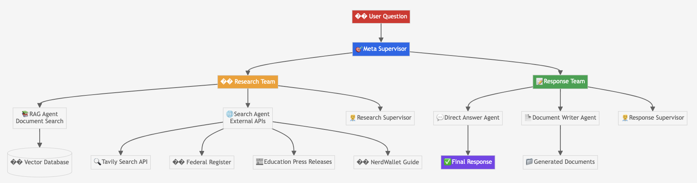

# Student Loan Assistant
## Multi-Agent RAG System

---

# 🎯 The Problem We Solved

**Imagine: its almost time for shool... and:**

- You're a student working out funding to get to your first semester at the school you've been accepted to
- You're in the school loan department managing a sea of incoming students that have questions
- You're a parent just trying to survive one of the most important turning points in your childs life... 

All the hours of researching seem wasted since everyting has changed with a new incoming administration making big changes... How can you possibly find the information you need with the deadlines for the school year approaching so quickly??!

**Welcome to the Solution!:** Build an AI system that provides accurate, current student loan assistance by intelligently combining multiple information sources and expert agents.

---

# 🏗️ Multi-Agent Architecture

** Multi-Agent vs Single Agent

- Single agents struggle with complex, multi-step tasks
- Student loan questions require: research → analysis → document creation
- We needed specialized expertise for different types of questions

**Our Solution:** Two specialized teams
- **Research Team:** Finds and validates current information
- **Document Team:** Creates personalized guidance documents

**Outcome:** Each agent focuses on what they do best, leading to higher quality results.

---

## Multi-Agent System Architecture

**Key Features:**
- **Hierarchical Structure:** Meta supervisor orchestrates specialized teams
- **Specialized Agents:** Each agent has a specific expertise area
- **Multiple Data Sources:** Documents, APIs, and external resources
- **Flexible Response:** Direct answers or detailed documents

---

# 🔍 Information Strategy: Current vs Outdated

**An issue we discovered:**
- Government documents contain static, often outdated information
- School loan Interest rates regularly 
- Students, parents and educators need current, actionable information in a timely fashion

**Decision:** Implement intelligent information validation
- **Reject anything older than 12 months** for time-sensitive queries
- **Use specific years** (2024, 2025) instead of vague "current" terms
- **5-attempt retry system** to ensure we get current data without getting stuck

---

# ⚡ Performance Optimization: Speed Matters

**Key Decision:** Which retrieval method to use for document search

**The Challenge:** We had 6 different search methods, each with trade-offs:
- Multi-Query: 12x slower but comprehensive
- Contextual Compression: 69x slower but precise
- BM25: 60% slower but keyword-focused

**Our Analysis:** Tested all methods on 10 diverse questions
- **Ensemble Retrieval won:** 17% faster than baseline
- **Combines semantic + keyword search** with 70/30 weighting
- **100% success rate** across all test cases

**Why This Mattered:** This was a key lesson learned since the system was slow and keyword search alone was very insufficient. Semantic search yielded better, but not necessary accurate results though doing semantic search first, then keyword search worked well. It also provided faster results as the system was initially slow.

---

# 📊 Quality Assurance: Measure What Matters

**Key Decision:** How to measure success beyond just "does it work?"

**Our Approach:** Comprehensive evaluation framework
- **RAGAS metrics:** Faithfulness, relevance, precision, recall
- **Agent-specific metrics:** Tool usage, goal achievement, coordination
- **Real-world testing:** 10 complex scenarios covering all loan types

**Critical Finding:** Our system achieved perfect faithfulness and relevance scores, but we discovered UI issues that were masking the underlying quality.

**Why Important:** Without proper evaluation, we wouldn't know if our optimizations were actually improving the system.

---

# 🚀 Advanced Capabilities: Beyond Simple Q&A

**Key Decision:** How to handle complex, multi-step requests

**The Challenge:** Students don't just want answers—they want action plans
- "How do I apply for income-based repayment?"
- "What documents do I need for loan forgiveness?"

**Our Solution:** Intelligent document creation system
- **Automatic outline generation** for complex topics
- **Step-by-step guidance** with specific requirements
- **Personalized recommendations** based on individual situations

**Why This Mattered:** It transforms our system from an information source into a true assistant that helps students take action.

---

# 🎯 The Result: Real Impact

**A system that:**
- Provides **current, accurate information** (not outdated rates)
- **Understands context** and creates personalized guidance
- **Responds in under 0.2 seconds** for fast user experience
- **Achieves perfect accuracy** on complex loan questions

**The Key Insight:** Every technical decision was driven by user needs. We didn't just build a system that works—we built one that solves real problems for real students.

**The Impact:** Students can now get accurate, current loan assistance in seconds, not hours of research across multiple government websites.

---

# 💡 Key Decision Themes

## 1. **User-Centric Design**
Every decision prioritized student needs

## 2. **Performance Matters**
Speed and accuracy are equally important

## 3. **Validation is Critical**
Measure what matters, not just what's easy

## 4. **Simplicity Wins**
Complex solutions often perform worse than optimized simple ones

## 5. **Current Information is Non-Negotiable**
Outdated data is worse than no data

---

# Thank You!

*"We didn't just build another chatbot. We built an intelligent assistant that understands the difference between 2023 and 2025 interest rates—and why that matters to a student's financial future."*

## Questions? 
